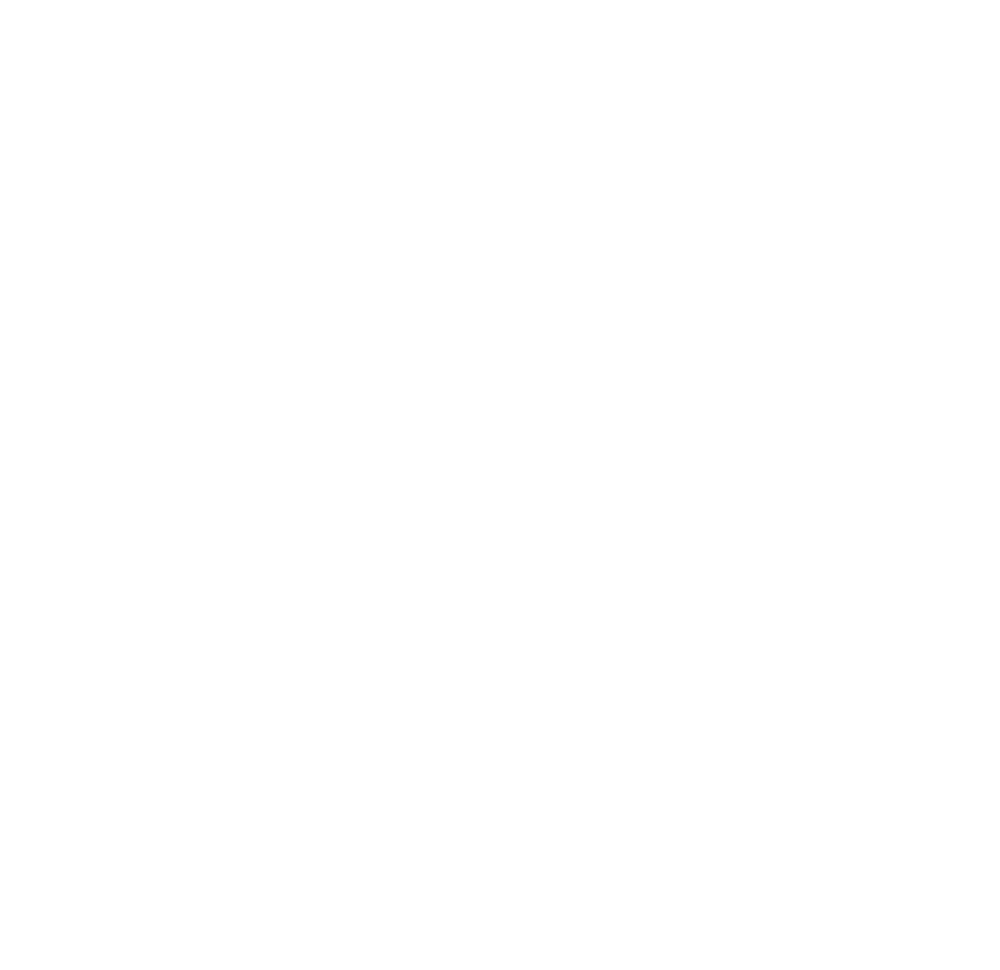

<h1 align="center"> NYX [Cath.exe] </h1> 
<!-- header -->

    
     
    
    <a href= "https://creativecommons.org/licenses/by-nc-sa/4.0/" target="_blank">
    
    <a href="https://github.com/night0721/cath">
    
      
    
    
    

    

<!-- description -->

**NYX** _(previously known as Cath)_ is a first and only **COD Mobile Statistics & Gunsmith** Bot which also doubles as a multipurpose discord bot with many features that include but are not limited to Moderation, Music and Economy.  
The Call of Duty Stats are courtesy of **Stats on Duty** & **Round Table** 
🔺 **Apex Legends Commands** will be added soon, the player stats command will be added after the global launch when the API supports it.
  
If you like this bot, feel free to :star: **Star** this repository. 

> ⚠ The Verifed bot instance is current called Cath.exe, we are working on getting it changed
>  

# Features

> _This is a Non-Exhaustive list for commands. To access the full list of commands, check out our [Documentation](https://thunder75.gitbook.io/cath-bot/core/commands)._

🚨 **Moderation** - Classic commands like kick, ban, warn, role and many more.  
📈 **Economy** - A Robust economy system, inspired by **pepe bot**  
✨ **Fun Commands** - A massive collection of fun commands `(35+ commands)`  
🎵 **Music** - Classic Music Commands that can play from various sources.  
🛠 **Utility** - A wide range of useful commands `(Around 20)`  
🕹 **Games** - Many fun games to spend your time  
🎮 **Call of Duty** - Check the list of Call of Duty Mobile Commands

##  **Call of Duty Mobile**

- **Weapon Statistics** courtesy of **Round Table** & **Stats On Duty**
- **Currated Gunsmith Builds** by various content creators like Jokesta, dHitman, Path.exe, Stats On Duty and more comming soon.
- **Perks** detailed info about the perks.
- **Scorestreak** detailed info about scorestreak with preview videos.
- **Randomly Generated Class** Wanna try something challenging? try our Randomly Generated Gunsmith builds.

> We also provide access to our database that includes In-depth Weapon statistics & Gunsmith Builds from various Content Creators, & other Call of duty related info, please [contact us](https://rebrand.ly/cathSupport) for more info.

##  **Apex Legends Mobile**

> ⚠ _Coming Soon™_

- **Player Stats** view your in-game stats. <!-- if they support mobile for the stats api -->
- **Legends** detailed info about legends & their abilities.
- **Guns** detailed info about guns.
- **Random Combos** Wanna try something challenging? try to win a game with a random selected legend & Gun combination
- _& many more, coming soon!_

## More Info

A detailed Deployment guide can be found [here](https://thunder75.gitbook.io/cath-bot/deployment).

<!-- 

  
Made With

   
   
   
   
    

  
Github Stats

  
  
  
  
  <!-- 

 -->

<h1 align = "center"> Support, Feature Request & Bug Reports </h1>

##  Support & Feature Request

Join the official [Support Server](https://rebrand.ly/cathSupport) on Discord & we will be happy to assist you.  
To Request new features contact us on Discord using the support server.

##  Report Bugs

You can report bugs or issues by opening a issue in this repository. Alternatevely you can also contact us on Discord using the support server.

  

<h1 align="center"> Contributors </h1>

Contributions are always welcomed, but make sure to read [Contributing.md](/CONTRIBUTING.md) first.

<!-- ## Special Thanks to The Roound Table from Cygnoux Familia.

  

 -->

⠀

<!--  -->
